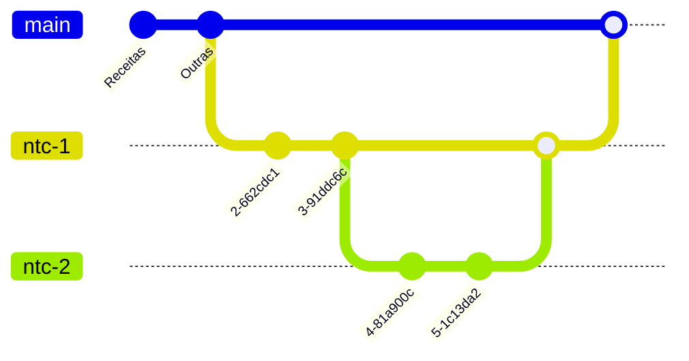

# Processos de uso de branches

```mermaid
gitGraph
    commit id:"Receitas"
    commit id:"Outras"
    branch ntc-1
    checkout ntc-1
    commit
    commit
    checkout ntc-1

    branch ntc-2
    checkout ntc-2
    commit
    commit
    checkout ntc-1
    merge ntc-2
    checkout main
    merge ntc-1
```